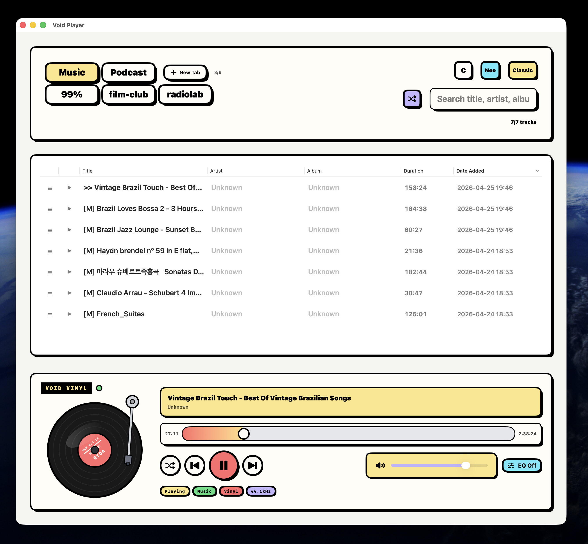
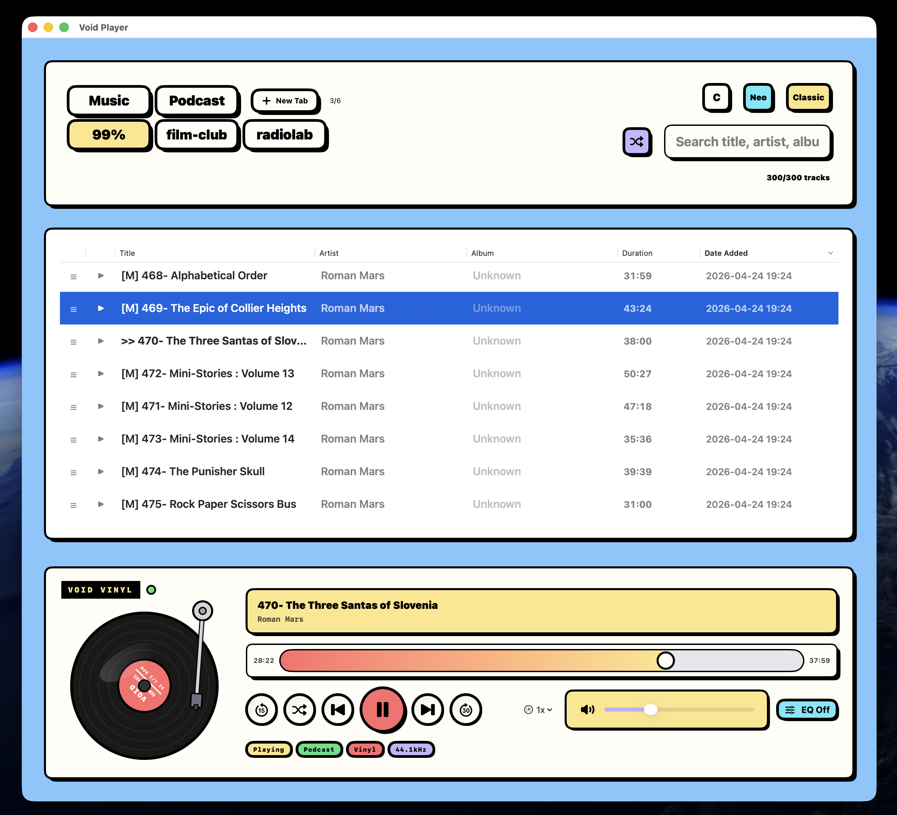

  
  
  
  
  

# Void Player-releases

**Public release repository for Void Player distribution artifacts.**

**Download the latest notarized DMG from the Releases page.**

**Video demo:** [https://youtu.be/buebfHu0ZSg](https://youtu.be/buebfHu0ZSg)

**Supports common local audio formats:** MP3, M4A, WAV, and FLAC 🎧

 
 

 

 

## ✨ Key Features
*   **Topic-Based Tabs:** Organize and enjoy music and podcasts by category for a clutter-free experience.
*   **Dual Shuffle Modes:**
    *   **Top-Right Shuffle:** Reorders the actual tracklist.
    *   **Bottom Shuffle:** Randomizes playback order while keeping the tracklist intact.

## ⌨️ Keyboard Shortcuts

You can instantly customize the UI and background color to match your taste.

| Shortcut | Action |
| --- | --- |
| <kbd>Command</kbd> + <kbd>3</kbd> | Cycle background color |
| <kbd>Command</kbd> + <kbd>8</kbd> | Switch to next UI mode |

## ⚙️ App Info

*   **Lightweight:** Built with **Swift** for an ultra-light file size of just **3.8MB**.
*   **Secure & Verified:** Distributed as an **Apple-notarized** .dmg file, ensuring a safe and reliable installation.

 

## Vinyl Mode

 

 

 

 

## Classic Mode

 

 

## Neo Mode

 

 
 

---

# Void Player 릴리스

**Void Player 배포 파일을 위한 공개 릴리스 저장소입니다.**

**최신 Apple 공증 DMG는 Releases 페이지에서 다운로드할 수 있습니다.**

**영상 데모:** [https://youtu.be/buebfHu0ZSg](https://youtu.be/buebfHu0ZSg)

**지원하는 주요 로컬 오디오 형식:** MP3, M4A, WAV, FLAC 🎧

 
 

 

## ✨ 주요 기능
*   **토픽 기반 탭:** 음악과 팟캐스트를 카테고리별로 정리해 더 깔끔하게 감상할 수 있습니다.
*   **두 가지 셔플 모드:**
    *   **오른쪽 상단 셔플:** 실제 트랙 목록의 순서를 섞습니다.
    *   **하단 셔플:** 트랙 목록은 유지한 채 재생 순서만 무작위로 바꿉니다.

## ⌨️ 키보드 단축키

취향에 맞게 UI와 배경 색상을 바로 바꿀 수 있습니다.

| 단축키 | 동작 |
| --- | --- |
| <kbd>Command</kbd> + <kbd>3</kbd> | 배경 색상 전환 |
| <kbd>Command</kbd> + <kbd>8</kbd> | 다음 UI 모드로 전환 |

## ⚙️ 앱 정보

*   **가벼운 앱:** **Swift**로 제작되어 파일 크기가 약 **3.8MB**로 매우 가볍습니다.
*   **안전한 배포:** **Apple 공증**을 받은 .dmg 파일로 배포되어 더 안심하고 설치할 수 있습니다.

 

## Vinyl Mode

 

 

## Classic Mode

 

## Neo Mode

 
 

---

# Void Player リリース

**Void Player の配布ファイルを公開するリリース用リポジトリです。**

**最新の Apple 公証済み DMG は Releases ページからダウンロードできます。**

**動画デモ:** [https://youtu.be/buebfHu0ZSg](https://youtu.be/buebfHu0ZSg)

**対応する主なローカルオーディオ形式:** MP3, M4A, WAV, FLAC 🎧

 
 

 

## ✨ 主な機能
*   **トピック別タブ:** 音楽やポッドキャストをカテゴリごとに整理し、すっきり楽しめます。
*   **2種類のシャッフルモード:**
    *   **右上のシャッフル:** 実際のトラックリストの順番を並べ替えます。
    *   **下部のシャッフル:** トラックリストはそのままに、再生順だけをランダムにします。

## ⌨️ キーボードショートカット

好みに合わせて UI と背景色をすぐに切り替えられます。

| ショートカット | 動作 |
| --- | --- |
| <kbd>Command</kbd> + <kbd>3</kbd> | 背景色を切り替え |
| <kbd>Command</kbd> + <kbd>8</kbd> | 次の UI モードに切り替え |

## ⚙️ アプリ情報

*   **軽量:** **Swift** で作られており、ファイルサイズは約 **3.8MB** と非常に軽量です。
*   **安全な配布:** **Apple 公証済み** の .dmg ファイルとして配布されるため、安心してインストールできます。

 

## Vinyl Mode

 

 

## Classic Mode

 

## Neo Mode

 
 

---

# Lanzamientos de Void Player

**Repositorio público de lanzamientos para los archivos de distribución de Void Player.**

**Descarga el DMG más reciente notarizado por Apple desde la página de Releases.**

**Demo en video:** [https://youtu.be/buebfHu0ZSg](https://youtu.be/buebfHu0ZSg)

**Formatos de audio locales compatibles:** MP3, M4A, WAV y FLAC 🎧

 
 

 

## ✨ Funciones principales
*   **Pestañas por tema:** Organiza y disfruta música y podcasts por categoría para una experiencia más limpia.
*   **Dos modos de reproducción aleatoria:**
    *   **Aleatorio superior derecho:** Reordena la lista real de pistas.
    *   **Aleatorio inferior:** Cambia el orden de reproducción sin modificar la lista de pistas.

## ⌨️ Atajos de teclado

Puedes personalizar al instante la UI y el color de fondo según tu gusto.

| Atajo | Acción |
| --- | --- |
| <kbd>Command</kbd> + <kbd>3</kbd> | Cambiar color de fondo |
| <kbd>Command</kbd> + <kbd>8</kbd> | Cambiar al siguiente modo de UI |

## ⚙️ Información de la app

*   **Ligera:** Creada con **Swift**, con un tamaño de archivo ultraligero de solo **3.8MB**.
*   **Segura y verificada:** Se distribuye como archivo .dmg **notarizado por Apple**, para una instalación segura y confiable.

 

## Vinyl Mode

 

 

## Classic Mode

 

## Neo Mode

 
 

---

# Void Player 发布

**用于发布 Void Player 分发文件的公开发布仓库。**

**可在 Releases 页面下载最新的 Apple 公证 DMG。**

**视频演示:** [https://youtu.be/buebfHu0ZSg](https://youtu.be/buebfHu0ZSg)

**支持的常见本地音频格式:** MP3、M4A、WAV 和 FLAC 🎧

 
 

 

## ✨ 主要功能
*   **基于主题的标签页:** 按类别整理并欣赏音乐和播客，让体验更清爽。
*   **两种随机播放模式:**
    *   **右上角随机:** 重新排列实际曲目列表。
    *   **底部随机:** 保持曲目列表不变，只随机播放顺序。

## ⌨️ 键盘快捷键

你可以根据自己的喜好快速切换 UI 和背景颜色。

| 快捷键 | 操作 |
| --- | --- |
| <kbd>Command</kbd> + <kbd>3</kbd> | 切换背景颜色 |
| <kbd>Command</kbd> + <kbd>8</kbd> | 切换到下一个 UI 模式 |

## ⚙️ 应用信息

*   **轻量:** 使用 **Swift** 构建，文件大小仅约 **3.8MB**。
*   **安全且已验证:** 以 **Apple 公证** 的 .dmg 文件分发，安装更安心可靠。

 

## Vinyl Mode

 

 

## Classic Mode

 

## Neo Mode

